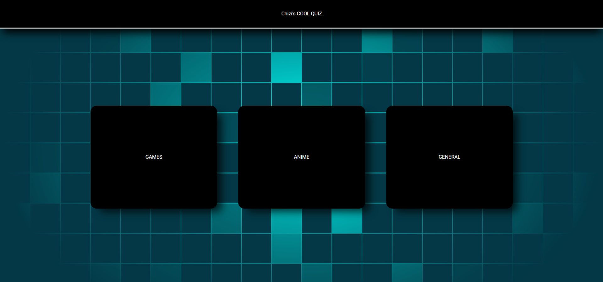

# Chizi's Cool Quiz: A Quiz Application
The application is the user-facing part of a quiz application. It is intended to test your knowledge on Anime, Games and just General Knowledge.

There are 4 modes. Easy, Medium, Hard and Dynamic which the program selects a random mode for you.

It is built using React and is packaged using Docker containers.

## Screenshot
 

## Deployment

### Docker
Build the dockerfile with the following commands

docker build -t quiz-app .

docker run -p 3000:3000 -d quiz-app

## Available Scripts

In the project directory, you can run:

### `npm start`

Runs the app in the development mode.\
Open [http://localhost:3000](http://localhost:3000) to view it in your browser.

The page will reload when you make changes.\
You may also see any lint errors in the console.

### `npm test`

Launches the test runner in the interactive watch mode.\
See the section about [running tests](https://facebook.github.io/create-react-app/docs/running-tests) for more information.

### `npm run build`

Builds the app for production to the `build` folder.\
It correctly bundles React in production mode and optimizes the build for the best performance.

The build is minified and the filenames include the hashes.\
Your app is ready to be deployed!

See the section about [deployment](https://facebook.github.io/create-react-app/docs/deployment) for more information.

## Bugs, Feature Requests and Contributing
I'd love to accept your contributions; large or small. Simply submit an issue or pull request via Github. Please open an issue if you have found an issue or have an idea for a new feature. P

